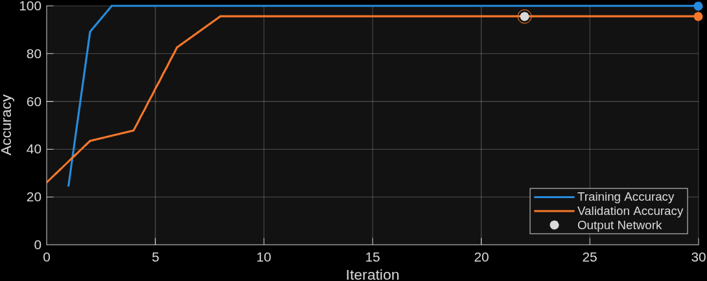

# Solution to Image-Based Defect Detection for Manufacturing Inspection

[](https://matlab.mathworks.com/open/github/v1?repo=shaiyaish/MATLAB-Image-Based-Defect-Detection-Project&file=ImageBasedDefectSystem.mlx)

## Project Objective
The objective behind the project is to create a simple, AI-integrated MATLAB program that can categorize manufactured metal plates in either "Pass" or "Fail". The intended use of the program would be to make it easy and accessible for workers in the manufacturing industry to be able to use algorithm-based programs that can analyze patterns of defects in products in seconds. A program that can easily classify and recognize patterns would save time and money for many manufacturing companies.

## Steps to Run Code/Models
- Click the "Open MatLab Online" button to launch in MATLAB online. This should set it up automatically.
<p>OR</p>

- Clone repository and run ImageBasedDefectSystem.mlx after installing dependencies. If everything was cloned correctly, it should run without issue.
<p>OR</p>

- Open ImageBasedDefectSystem.pdf to look at a pre-run result of the program.

### Toolboxes and Dependencies
- Deep Learning Toolbox
- Deep Learning Toolbox Model for ResNet-18 Network
- Image Processing Toolbox

## Results
* Below is the result of training a ResNet18 Network on our dataset, and what we end up using in our program.



- You can find an expected output of the entire program through the "ImageBasedDefectSystem.pdf" file.

## Contributors
| Team Member    | Role                                        |
| :------------- | :------------------------------------------ |
| Shai Yaish     | Modeling and Quality Assurance Lead         |
| Thao Mai       | Documentation/Visualization Lead            |
| Brayan Camacho | Analysis/Validation Lead and Project Manager|

## Reference
[MPDD Dataset:](https://github.com/stepanje/MPDD)
```
@INPROCEEDINGS{9631567,
  author={Jezek, Stepan and Jonak, Martin and Burget, Radim and Dvorak, Pavel and Skotak, Milos},
  booktitle={2021 13th International Congress on Ultra Modern Telecommunications and Control Systems and Workshops (ICUMT)}, 
  title={Deep learning-based defect detection of metal parts: evaluating current methods in complex conditions}, 
  year={2021},
  volume={},
  number={},
  pages={66-71},
  doi={10.1109/ICUMT54235.2021.9631567}
}
```